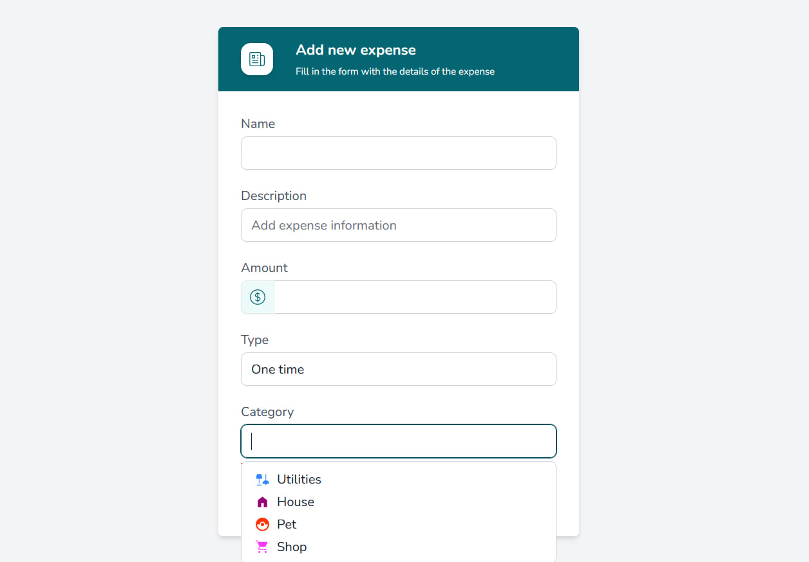
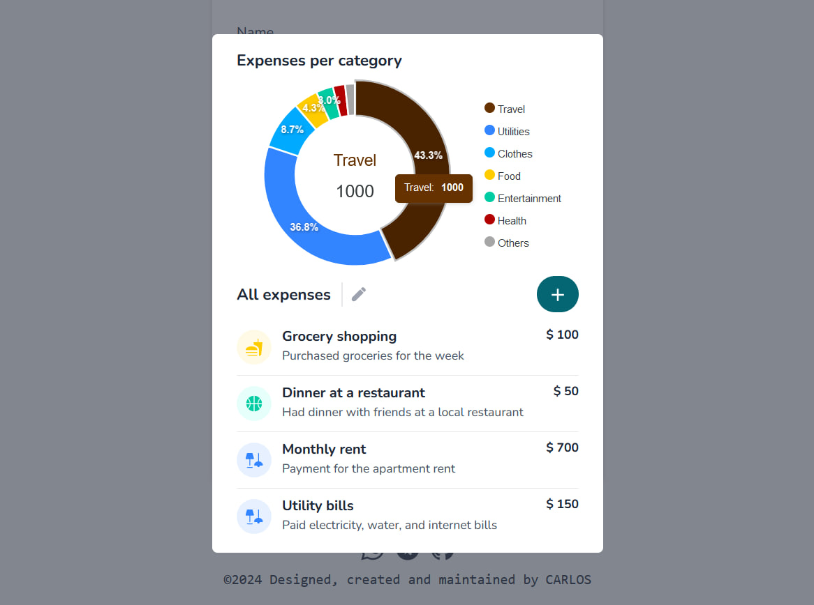

# Expense Manager
## Description
A web application made with Nuxt 3 for expense management. It stores data persistently using Pinia and the browser's localStorage. Styling is with Flowbite and Tailwindcss.

## Design



## Build Setup
```bash
# install dependencies
$ npm install

# compile tailwind config changes
$ npm run build

# serve with hot reload at localhost:3000
$ npm run dev
```

## Contribution
To contribute to this project please check out the [contribution guidelines](https://github.com/YurisCodingClub/accessibility-mentor/blob/main/CONTRIBUTING.md).
